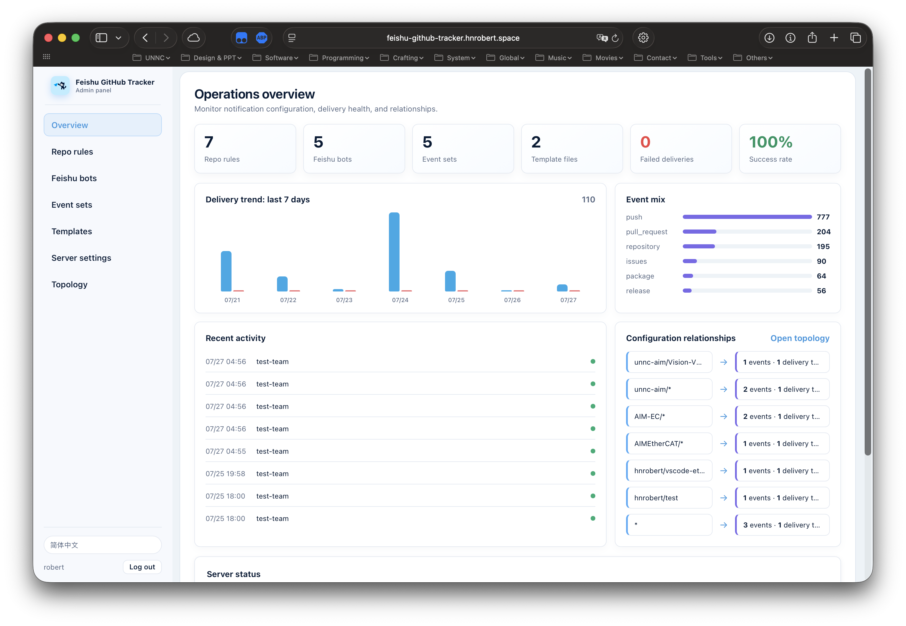

# Feishu GitHub Tracker

[](https://github.com/hnrobert/feishu-github-tracker/actions/workflows/ci.yml)
[](go.mod)
[](LICENSE)

一个用于接收 GitHub Webhook 并转发到飞书机器人的中间件服务。支持灵活的配置、事件过滤和自定义消息模板。


## 写在前面

### 为什么有这个项目

首先，众所周知，飞书在目前没有一个官方的 GitHub 集成（至少在国内是这样，也许之前有，后来因为种种原因总之是没了）。虽然可以通过 GitMaya 等第三方服务实现，但不是不完善（比如 GitMaya 2024 年初还在更新的，结果现在是不可用状态），要不就是操作比较复杂（胡言乱语无法理解）或者通过 `workflow` 实现（太麻烦），要不就是过于简单，无法满足实际需求。

所以，我还是决定直接搓一个给大伙用了。我这边的主要目标是：

- 简单易用：配置简单，Docker Compose 开箱即用，基于 GitHub 的 Webhook 实现
- 可视化管理：内置 Web 管理面板，浏览器里即可增删改仓库规则、飞书机器人、事件、模板等，无需手改 YAML
- 灵活可定制：支持多种事件过滤和自定义消息模板，按事件修改 `configs/templates/<语言>/` 下的对应文件即可满足大部分的模版定制需求。
- 高效稳定：使用 Go 语言编写，性能优越
- 安全可靠：支持签名验证，防止伪造请求
- 开源免费：MIT 许可证，欢迎自开分支或者贡献回来（plz）

## 支持的 GitHub 事件

目前支持所有的 GitHub Webhook 事件

- 事件集合定义详见 [example-configs/events/event_sets/](example-configs/events/event_sets/)，单个事件的默认过滤配置详见 [example-configs/events/definitions/](example-configs/events/definitions/)
- 对应的处理方法以及文档详见 [internal/handler/](internal/handler/)
- 默认提供的消息模板详见 [example-configs/templates/default/](example-configs/templates/default/)（中文模板在 [example-configs/templates/cn/](example-configs/templates/cn/)）
- 也可以自定义模板，使用我们 `handler` 提供的的 `占位符变量` ([详见文档](internal/handler/README.md)) 以及 `template` 提供的 `模板引擎的语法` `过滤器` `条件块` 等功能 ([详见文档](internal/template/README.md)) 对发出消息的格式做相应的修改

### Webhook 设置提醒

当你在 GitHub 上添加 Webhook 时（无论是仓库级别还是组织级别），GitHub 会发送一个 **ping 事件**来测试 Webhook 配置。本服务会：

1. **自动识别 ping 事件**：无需在 `patterns/` 规则中特别配置
2. **智能匹配通知目标**：
   - 对于组织级 webhook：自动发送到配置了该组织所有仓库的飞书 bot, 即仅 `org-name/*` 模式匹配的仓库
   - 对于仓库级 webhook：自动发送到配置了该仓库的飞书 bot
3. **发送成功通知**：向飞书发送一条友好的 Webhook 设置成功消息，包含：
   - GitHub 禅语（zen message）
   - Hook ID 和类型
   - 仓库或组织信息

这样你就能立即确认 Webhook 已正确配置并能正常工作。

### 消息演示

<details open>
<summary>Misc</summary>


</details>

<details>
<summary>支持双语 / Bilingual support（所有卡片都有对应）</summary>

- 支持中英文双语快速切换
- 所有事件卡片均有对应的中英文版本
- 模板目录按语言组织：`configs/templates/default/`（默认/英文）与 `configs/templates/cn/`（中文），每个事件一个 JSON 文件


</details>

<details>
<summary>Workflow 通知 / Workflow notifications</summary>


</details>

<details>
<summary>Release 通知 / Release notifications</summary>


</details>

<details>
<summary>Issue 相关 / Issue related</summary>


</details>

<details>
<summary>PR 相关 / PR related</summary>


</details>

<details>
<summary>其他事件 / Other events（Star、Watch 等）</summary>


</details>

## 快速开始

参考 [docs/quickstart.md](./docs/quickstart.md) 了解如何快速自建服务器部署和测试；从源码构建见 [docs/build-from-source.md](./docs/build-from-source.md)。

### 体验/使用现成服务（适合自己部署成本/难度较高的用户）

当然我们也有部署好的服务（<https://feishu-github-tracker.hnrobert.space/webhook>，直接 call 是没效果的，需要在我的服务器上更新配置才能转发到你那里 😈）可供大家使用或者尝试（下方邮件联系我获取试用和少量技术支持）。由于当前的服务是部署在个人服务器上需要运维成本，且配置当前依然需要人力维护，如果想要长期使用，需联系我付费 25¥ (含**永久使用权** + **1 年的不限次数配置更新&技术支持**，1 年后如需要更新配置或者技术支持，也请续费 10¥/年~~辛苦费~~)。

当然为了鼓励大家参与开源，**如果你能提一个有效的 PR（修复 bug 或者添加功能（请先提 issue））且最终被合并，或者提出一个详细的包含修复方法的 bug report issue**，试用款可以全额退回，后续也不需要支出任何额外费用。

如有想法可以邮件联系我：[hnrobert@qq.com](mailto:hnrobert@qq.com)

## 项目结构

```text
feishu-github-tracker/
├── cmd/
│   └── feishu-github-tracker/          # 主程序入口
│       └── main.go
├── internal/             # 内部包
│   ├── auth/            # 签名验证
│   ├── config/          # 配置加载与旧格式自动迁移
│   ├── handler/         # Webhook 处理器
│   ├── logger/          # 日志模块（按天轮转）
│   ├── matcher/         # 仓库和事件匹配
│   ├── notifier/        # 飞书通知发送
│   ├── panel/           # Web 管理面板
│   └── template/        # 模板处理
├── example-configs/     # 受 Git 跟踪的默认配置与注释示例
│   ├── server.yaml      # 服务监听 / 密钥 / 面板账号（单文件）
│   ├── feishu-bots.yaml # 飞书机器人别名（单文件）
│   ├── patterns/        # 每条仓库规则一个 YAML 文件
│   ├── events/          # event_sets/ 事件集合 + definitions/ 事件定义
│   └── templates/       # 按语言分目录，每个事件一个 JSON 文件
│       ├── default/
│       └── cn/
├── configs/             # 运行时配置目录，首次启动生成且不受 Git 跟踪
├── logs/                 # 日志文件目录
├── Dockerfile           # Docker 镜像构建
├── docker-compose.yml   # Docker Compose 配置
├── Makefile            # 构建脚本
└── README.md
```

## 配置说明

仓库中的 [example-configs](example-configs) 是可随版本更新的默认配置；运行时请编辑 `configs/`。Docker Compose 首次启动会自动从示例目录复制缺失文件，已有文件绝不会被覆盖，因此更新代码不会再因本地配置修改而阻塞。

配置按「每条规则一个文件」组织：

| 内容 | 位置 | 说明 |
| --- | --- | --- |
| 服务监听 / 密钥 / 面板账号 | `server.yaml` | 单文件 |
| 飞书机器人别名 | `feishu-bots.yaml` | 单文件 |
| 仓库规则（pattern） | `patterns/*.yaml` | 每条规则一个文件 |
| 事件集合 / 事件定义 | `events/event_sets/*.yaml`、`events/definitions/*.yaml` | 每个集合/事件一个文件 |
| 消息模板 | `templates/<语言>/<事件>.json` | 按语言分目录，每个事件一个文件 |

### 旧版本配置自动迁移

从旧版镜像升级时，启动会自动检测旧版单文件配置（`repos.yaml`、`events.yaml`、`templates.jsonc`、`templates.*.jsonc`）：

- 原文件**原样**移动到 `configs/legacy/` 备份
- 同时拆分为上述新的分文件格式；`repos.yaml` 中的规则顺序会转换为 `patterns/*.yaml` 里的 `weight` 字段（越靠前的规则 weight 越大，评估顺序与原配置一致）
- 迁移只执行一次，之后以新格式为准；旧格式的单文件也仍然兼容读取（子目录优先）

### server.yaml

服务器基础配置：

```yaml
server:
  host: '0.0.0.0' # Webhook监听主机
  port: 4594 # Webhook监听端口
  # secret: 'your_secret' # 可选：全局 Webhook 密钥（fallback），用于验证 GitHub X-Hub-Signature。留空/注释掉则不启用全局校验（可改用每条 pattern 规则各自的 secret）。若某条规则单独配置了 secret，则该规则优先使用自己的 secret，否则回退到这里
  log_level: 'info' # 可选: debug, info, warn, error
  match_all_rules: false # 可选：让同一 webhook 依次匹配所有规则；false 时仅首条（按 weight 最高）匹配生效
  max_payload_size: 25MB # 限制单次 Webhook body 大小（GitHub 官方载荷上限为 25MB；超过返回 413）
  timeout: 15 # 单次请求处理超时 (秒)

# 允许的来源（用于白名单过滤，可选）
allowed_sources:
  - 'github.com'
  - 'api.github.com'
  - 'your-github-enterprise-domain.com'
```

管理面板账号也配置在 `server.yaml` 的 `panel:` 段（默认 `admin`/`admin`），详见下方[管理面板](#管理面板)一节。

### feishu-bots.yaml

定义飞书机器人及其别名：

```yaml
feishu_bots:
  - alias: 'dev-team' # 可以在 patterns/*.yaml 中通过该别名引用这个链接
    url: 'https://open.feishu.cn/open-apis/bot/v2/hook/xxxxxxx'

  - alias: 'ops-team'
    url: 'https://open.feishu.cn/open-apis/bot/v2/hook/yyyyyyy'

  - alias: 'org-notify'
    url: 'https://open.feishu.cn/open-apis/bot/v2/hook/zzzzzzz'

  - alias: 'org-cn-notify'
    url: 'https://open.feishu.cn/open-apis/bot/v2/hook/aaaaaaa'
    template: 'cn' # 可选：指定使用的消息模板，默认为 'default'
```

**多模板支持**：

从 v1.1.0 开始，支持为不同的飞书 bot 配置不同的消息模板。这在以下场景特别有用：

- 中英文双语团队，需要发送不同语言的通知
- 不同团队需要不同格式的消息
- 测试环境和生产环境使用不同的消息格式

配置方法：

1. 在 `feishu-bots.yaml` 中为 bot 指定 `template` 字段（可选）
2. 在 `configs/templates/` 下创建以该模板名命名的目录，目录内每个事件一个 `<事件名>.json` 文件

例如：

- `templates/default/` - 默认模板（必需）
- `templates/cn/` - 中文模板
- `templates/en/` - 英文模板
- `templates/simple/` - 简化模板

如果某个 bot 没有指定 `template` 字段，或指定的模板目录不存在，将自动使用 `templates/default/` 作为默认模板。

> 旧版的单文件 `templates.jsonc` / `templates.<名称>.jsonc` 仍然兼容读取；启动时会自动迁移为分文件格式（原件备份到 `configs/legacy/`）。

### events/

事件配置分两个子目录：

- `events/event_sets/<名称>.yaml` — 事件集合（可复用的事件包，供 pattern 规则引用）
- `events/definitions/<事件名>.yaml` — 单个事件的默认过滤配置（分支 / action 等）

```yaml
# events/event_sets/basic.yaml —— 基础事件集
push:
pull_request:
pull_request_review:
pull_request_review_comment:
issues:
issue_comment:
discussion:
discussion_comment:
release:
package:
```

```yaml
# events/event_sets/custom.yaml —— 自定义事件集
push:
  branches:
    - main
    - develop
pull_request:
  types:
    - opened
    - closed
```

具体参考 [example-configs/events/event_sets/](example-configs/events/event_sets/) 与 [example-configs/events/definitions/](example-configs/events/definitions/) 中的示例与注释。事件配置可在管理面板「事件集合」页可视化编辑（逐文件卡片，保存时注释原样保留）。

### patterns/

每条仓库匹配规则一个文件（`patterns/<名称>.yaml`），文件名由 pattern 生成（`/` → `-`、`*` → `all`）：

```yaml
# patterns/CompPsyUnion-motion-vote-backend.yaml
weight: 5 # 优先级：数值越大越先评估。兜底的 * 规则应给最小值
pattern: 'CompPsyUnion/motion-vote-backend'
events:
  push: # 直接引用 events/definitions/ 中的事件
    branches: # 可以进一步细化，覆盖事件定义中的默认配置
      - main
      - develop
  pull_request: # 同理
    branches:
      - main
    types:
      - opened
      - closed
      - reopened
  issues: # 如果不细化，直接监听所有 types
  release:
notify_to:
  - ops-team # 引用 feishu-bots.yaml 的 alias. 引号可加可不加
  - 'https://open.feishu.cn/open-apis/bot/v2/hook/zzzzzzz' # 直接使用完整 URL 也可以。如有冲突 alias 优先
```

```yaml
# patterns/all.yaml —— 兜底规则：weight 最小，放最后评估
weight: 0
pattern: '*'
events:
  basic: # 应用 event_sets 中定义的 basic 集合（展开为该规则监听的事件）
  project: # 也可以同时叠加更多事件。注意后添加的会覆盖先添加的的同类事件配置
notify_to:
  - org-notify
```

**weight 说明**：规则按 `weight` **降序**评估（同 weight 时按 pattern 名排序）。默认仅使用第一条匹配的规则——精确规则给高 weight、`*` 兜底给低 weight，即可复现旧版「自上而下、`*` 放最后」的语义。管理面板中创建/编辑规则时可直接填写 weight。

### templates/

定义飞书消息卡片模板，按语言分目录、每个事件一个 JSON 文件（`templates/<语言>/<事件>.json`）。支持为同一事件定义多个模板变体（通过 `tags` 区分）。默认已内置所有常用事件的模板，可按需修改扩展。

这里的模板是基于飞书的消息卡片格式设计的，详情请参考 [飞书开放平台文档](https://open.feishu.cn/document/uAjLw4CM/ukTMukTMukTM/reference/im-v1/message/create)。

```json
// templates/default/push.json
{
  "payloads": [
    {
      "tags": ["push", "default"],
      "payload": {
        "msg_type": "interactive",
        "card": {}
      }
    },
    {
      "tags": ["push", "force"],
      "payload": {}
    }
  ]
}
```

模板支持 `占位符替换` ，如：

- `{{repo_name}}` - 仓库名称
- `{{sender_name}}` - 触发者
- `{{pr_title}}` - PR 标题
- `{{issue_number}}` - Issue 编号

以及一些 `tag` 的判断，如：

- `[push, force]` - 仅当是 force push 时使用该模板
- `[pull_request, closed, merged]` - 仅当 PR 被合并时

更多 `占位符` 和 `tag` 相关说明详见我们 `handler` 提供的的 `占位符变量` ([详见文档](internal/handler/README.md))

## 管理面板

自 v1.2.0 起服务内置了一个 Web 管理面板，方便用户在浏览器中直接管理仓库规则、飞书机器人、事件模板等配置，可与手动编辑 YAML 文件来更新配置的方法共存。



- **访问**：`http://<host>:4594/`（与 webhook 同端口；`/webhook`、`/health` 仍照常工作）
- **登录**：默认用户名 `admin` / 密码 `admin`（老版本升级且未配置过面板账号时也自动使用默认账号）
  - 用户名：`server.yaml` 的 `panel.username`、环境变量 `PANEL_USERNAME`，或面板「服务设置」页修改
  - 密码（优先级从高到低）：环境变量 `PANEL_PASSWORD`（推荐）→ `panel.password`（明文，启动/reload 时自动转为 `password_hash` 并删除明文行）→ `panel.password_hash`（直接填 `sha256(密码)` 的十六进制）
  - 浏览器登录时会把密码做 SHA-256 后再发送，明文不上网；修改密码需先验证当前密码
- **功能**：仓库规则（含 weight）、飞书机器人、事件集合/事件定义可视化编辑（逐文件卡片，注释保留）、按语言×事件编辑消息模板、服务设置与面板账号、运行概览仪表盘（投递趋势 / 事件分布 / 最近活动）、配置关系图谱；界面支持中/EN 切换
- **生效方式**：面板内保存后自动 reload（无需重启）；手动编辑 `configs/` 则需以 `-reload` 启动或重启进程。端口 / 密钥改动仍需重启
- **JWT 密钥**：`panel.secret` 或环境变量 `PANEL_JWT_SECRET`；留空则每次重启随机生成（所有人被登出）

## 高级功能

### 事件过滤

支持多级事件过滤：

1. **仓库级别**：使用 glob 模式匹配仓库
2. **事件类型级别**：选择需要的事件类型
3. **分支级别**：为 push/PR 指定分支规则
4. **动作级别**：为事件指定具体的 action（如 opened, closed）

### 多规则匹配与 weight

默认情况下，仓库事件只使用**weight 最高**的那条匹配规则（规则按 `weight` 降序、同 weight 按 pattern 名排序评估），适合使用精确规则覆盖通配符、将 `*` 作为兜底规则的配置方式。

若同一个仓库需要按事件发送到不同飞书机器人，可在 `server.yaml` 的 `server:` 下开启：

```yaml
match_all_rules: true
```

开启后会按 weight 降序评估所有匹配规则：不订阅当前事件的规则会跳过，订阅该事件的规则会使用自己的 `notify_to` 发送通知。相同目标在同一次 webhook 内只会收到一条消息，发送仍按顺序执行。例如：

```yaml
# patterns/acme-widget-release.yaml
weight: 30
pattern: "acme/widget"
events:
  release:
notify_to: [release-bot]
```

```yaml
# patterns/acme-widget-activity.yaml
weight: 20
pattern: "acme/widget"
events:
  all:
notify_to: [activity-bot]
```

```yaml
# patterns/acme-widget-review.yaml
weight: 10
pattern: "acme/widget"
events:
  reviewer:
notify_to: [review-bot]
```

在这个例子中，`issue_comment` 会通知 `activity-bot` 和 `review-bot`，而 `release` 会通知 `release-bot` 和 `activity-bot`。组织级 Webhook 保持原有行为。

### 模板选择

程序会根据事件的实际情况自动选择最合适的模板：

- Force push 会使用特殊的 force push 模板
- 已合并的 PR 关闭和未合并的 PR 关闭使用不同模板
- Issue 根据标签（bug/feature/task）选择不同样式

### 通知目标

`notify_to` 支持两种方式：

1. **别名引用**：引用 `feishu-bots.yaml` 中定义的 alias
2. **直接 URL**：直接提供完整的飞书 Webhook URL

### Webhook 密钥（可选 / per-rule secret）

默认情况下，所有 Webhook 用 `server.yaml` 中的全局 `server.secret` 校验签名。如果不同仓库/组织需要各自独立的密钥，可以在某条 pattern 规则文件中单独配置 `secret`：

```yaml
# patterns/acme-widget.yaml
weight: 10
pattern: 'acme/widget'
events:
  push:
notify_to:
  - dev-team
secret: 'this-repo-only-secret' # 可选：仅校验该仓库 Webhook 的签名
```

校验规则：匹配到该仓库/组织的 Webhook，会尝试用「该规则的 `secret`」与「全局 `server.secret`」两者校验，任一通过即可；若两者都为空则跳过校验。这样不同 GitHub 端的 Webhook 可以使用各自独立的密钥。

## 监控和维护

### 健康检查

访问 `/health` 端点检查服务状态：

```bash
curl http://localhost:4594/health
```

### 日志

日志同时输出到控制台和文件：

- 文件位置：`logs/feishu-github-tracker-YYYY-MM-DD.log`
- 每天自动创建新的日志文件
- 日志级别可在 `server.yaml` 中配置

## 开发

### 构建

```bash
# 本地构建
make build

# Docker 构建
make docker-build
```

### 测试

```bash
make test
```

### 代码格式化

```bash
make fmt
```

## 环境变量

- `CONFIG_DIR` - 运行时配置文件目录路径（Docker 默认：`/app/configs`）
- `DEFAULT_CONFIG_DIR` - 默认配置示例目录；启动时仅复制其中缺失的文件到 `CONFIG_DIR`
- `LOG_DIR` - 日志文件目录路径（默认：`./logs`）
- `TZ` - 时区设置（默认：`Asia/Shanghai`）
- `PANEL_USERNAME` - 管理面板用户名（覆盖 `server.yaml` 的 `panel.username`）
- `PANEL_PASSWORD` - 管理面板密码明文（自动取其 SHA-256 存储；优先级最高，推荐）
- `PANEL_JWT_SECRET` - 面板 JWT 签名密钥（覆盖 `server.yaml` 的 `panel.secret`）

## 贡献

欢迎提交 Issue 和 Pull Request！

## 许可证

本项目采用 MIT 许可证。详见 [LICENSE](LICENSE) 文件。

## 致谢

- [gobwas/glob](https://github.com/gobwas/glob) - Glob 模式匹配
- [go-yaml/yaml](https://github.com/go-yaml/yaml) - YAML 解析
- [Feishu Open Platform](https://open.feishu.cn/) - 飞书开放平台

## 联系方式

- 作者: hnrobert
- 项目地址: <https://github.com/hnrobert/feishu-github-tracker>
- Issues: <https://github.com/hnrobert/feishu-github-tracker/issues>
